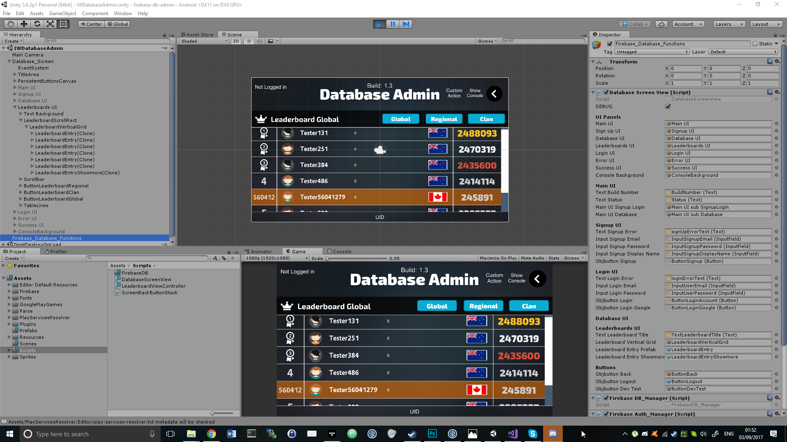

# Unity-Firebase-Leaderboard-Scripts-Only

My C# Unity Classes for a Google Firebase Database with UI handling and Authentication

## Disclaimer! This was written ~6 years ago (2017)!
Since then, my code has hopefully become neater. Some libraries may have changed, including the Firebase API 🙂

#### As this is a showcase, only a portion of the code is included

For licensing / custom implementation in your project please contact me via twitter

